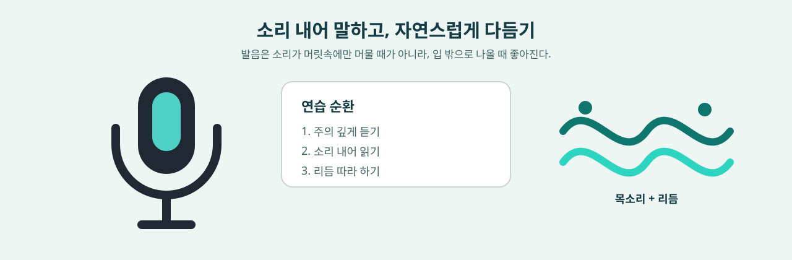

# 말하기 편: 뜻이 분명하게 닿게 하기

나는 한때 말하기를 즉석 시험처럼 여겼다. 입을 열기 전에 문장을 머릿속에서 먼저 짜 두어야 했고, 발음은 녹음 속 사람과 같아야 했으며, 멈춤은 없을수록 좋았고, 실수는 들켜서는 안 됐다. 그래서 잘 말하고 싶을수록 입을 열기 전에 넘어야 할 문턱은 더 높아졌다.

진짜 대화는 혼자 해내는 공연이 아니다. 상대는 추가 질문을 하고, 오해하고, 말을 보태고, 화제를 바꾼다. 저마다 다른 악센트, 말 속도, 기기, 배경을 안고 그 자리에 들어오기도 한다. 그래서 말하기 능력은 발음 안에만 머물지 않는다. 먼저 줄기를 말할 수 있는지, 상대가 따라오지 못했음을 알아챌 수 있는지, 다른 말로 바꿔 말할 수 있는지, 지금은 모른다고 인정할 수 있는지, 그리고 한 번 복구한 뒤에도 함께 일을 끝까지 해낼 수 있는지가 모두 여기에 들어간다.

이 장은 악센트를 없애 주겠다고 약속하지 않으며, 미국식이든 영국식이든 어떤 단일한 목소리도 영어의 종착점으로 삼지 않는다. 대신 더 실행하기 쉬운 길을 내놓는다. 자신의 청중과 관련된 참고 변이형 하나를 고르고, 다듬지 않은 녹음을 보관하고, 실제 청자에게 들은 뜻을 재진술하게 한다. 한 회차에는 영향이 큰 문제를 하나에서 셋까지만 고치고, 낯선 추가 질문, 다른 청자, 시간 압박으로 그 능력이 남아 있는지 다시 확인한다.

## 이 장 한눈에 보기

- 설명, 상호작용, 복구, 협업 중 어떤 과제인지 먼저 정한 뒤 무엇을 연습할지 결정한다.
- 독백, 문답, 상호작용 복구의 세 가지 원고 없는 기준선을 보관하고, 외운 원고로 말하기를 대신하지 않는다.
- 참고 변이형 하나를 골라 학습 자료를 비교적 일관되게 유지하면서, 여러 실제 영어에 차츰 적응한다.
- 악센트 두드러짐, 이해 가능도, 이해 난도를 구분하고, “다르게 들린다”를 곧바로 오류로 판정하지 않는다.
- 단어의 뜻, 시간, 숫자, 책임, 문장의 초점을 바꾸는 발음·리듬 문제부터 고친다.
- 섀도잉은 관찰과 모방을 맡고, 재진술·추가 질문·협업이 생성을 맡는다.
- AI와 음성 인식은 단서를 줄 수 있지만, 실제 청자의 재진술과 다음 행동이 더 강한 증거다.
- 14일 동안 실제 장면 하나와 영향이 큰 소수의 문제만 추적한다.

## 1. 먼저 말하기 과제를 분명히 한다

“말하기 실력 늘리기”는 너무 커서 곧바로 훈련할 수 없다. 실제로 일어날 행동으로 바꿔 써 보자.

| 과제 | 연습 조건 | 완료 증거 |
| --- | --- | --- |
| 설명 | 60-120초, 원고 없이 경험·관점·절차 말하기 | 청자가 요지와 핵심 세부 두 가지를 재진술함 |
| 문답 | 최소 다섯 차례, 낯선 추가 질문 하나 포함 | 답이 완전히 빗나가지 않고, 대화를 한 번은 스스로 진전시킴 |
| 복구 | 잘 못 들었거나 범위가 불분명하거나 표현에 실패한 순간 하나를 일부러 남겨 둠 | 반복·확인·바꿔 말하기로 양쪽이 공동의 이해를 되찾음 |
| 협업 | 회의, 면접, 고객 소통, 공동 의사결정 | 상대가 결론, 이견, 책임자, 다음 단계를 앎 |
| 전이 | 주제·청자·기기·말 속도·시간 제한 바꾸기 | 원래 원고에 기대지 않고도 비슷한 과제를 해냄 |

시작하기 전에 적어 두라. 누가 듣는가, 왜 듣는가, 끝난 뒤 상대는 무엇을 알거나 해야 하는가. 말하기는 모든 영어를 멋지게 말하는 일이 아니라, 지금의 조건에서 이 관계 속의 이 과제를 해내는 일이다.

[말하기 증거 카드](../../templates/speaking-evidence.md)를 복사해 녹음, 청자 재진술, 복구 행동, 지연 재측정을 한곳에 모아 둘 수 있다.

## 2. 다듬지 않은 기준선 세 가지를 보관한다

같은 사람이라도 독백은 유창한데 추가 질문 앞에서 방향을 잃을 수 있고, 발음은 또렷한데 상대가 정말 무엇을 물었는지 확인하지 못할 수도 있다. 최소 세 가지 표본을 보관하라.

1. **독백 기준선**: 원고 없이 90-120초 동안 실제 경험이나 문제 하나를 설명한다.
2. **상호작용 기준선**: 다섯 차례 문답을 하되, 그중 한 질문은 미리 알지 못한 것으로 한다.
3. **복구 기준선**: 반복 요청, 범위 확인, 바꿔 말하기, 합의 요약 중 한 번을 기록한다.

표본마다 원본 녹음을 남기고, 잡음을 먼저 없애거나 멈춤을 잘라 내거나 AI로 다시 쓰지 않는다. 기기, 네트워크, 개요를 봤는지, 다시 녹음을 허용했는지, 청자가 주제에 익숙한지를 기록한다. 조건이 다르면 수행을 곧바로 비교할 수 없다.

청자에게는 녹음만 듣고 답하게 한다.

```markdown
들은 요지:
가장 분명했던 세부 두 가지:
추측하거나 다시 들어야 했던 곳:
다음에 무엇을 묻거나 하겠는가:
```

전사본은 어휘와 구조를 드러내지만, 목소리에 담긴 강세, 멈춤, 어조, 상호작용의 타이밍을 대신하지는 못한다. 먼저 듣고, 그다음 글을 보라.

## 3. 참고 변이형을 고르되 위계를 만들지 않는다

영어에는 지역, 공동체, 직업, 개인에 따른 차이가 있다. 미국식과 영국식은 흔히 쓰는 참고 출발점일 뿐, 영어의 전부도 아니고 높고 낮은 등급도 아니다.

참고 변이형을 고를 때는 네 가지를 본다.

1. **실제 청중**: 주로 어떤 동료, 고객, 교사, 시험, 공동체를 상대하는가?
2. **안정된 자료**: 사전 음성, 강의, 피드백을 주는 사람이 오래도록 비교적 일관될 수 있는가?
3. **과제 비용**: 철자·어휘·발음 차이가 지금의 전달에 정말 영향을 주는가?
4. **개인의 정체성**: 이 목소리를 오래 쓸 마음이 있는가, 아니면 모방 속에 자신을 숨기려는 것인가?

참고 변이형의 역할은 초기의 결정을 줄이는 데 있다. 같은 단어는 우선 믿을 만한 음성 한 세트를 따르고, 같은 공식 문서 안에서는 철자를 일관되게 유지한다. 다른 변이형을 배척하라는 뜻은 아니다. 실제 협업에서 청자는 인도, 싱가포르, 나이지리아, 중국, 미국, 영국 등 훨씬 다양한 언어 배경에서 올 수 있다. 그러니 다른 악센트, 말 속도, 상호작용 방식의 입력도 차츰 늘려 가야 한다.

스스로 경계 두 가지를 적어 둘 수 있다.

```markdown
현재 참고 변이형:
이것을 고른 이유:
차츰 알아들어야 할 다른 변이형:
알아듣기만 하면 되고 억지로 흉내 낼 필요는 없는 차이:
```

일관성은 학습을 위한 것이고, 차이를 견디는 힘은 현실을 위한 것이다. “하나를 고르자”가 “하나만 옳다”로 바뀌지 않게 하라.

## 4. 악센트, 이해 가능도, 이해 난도를 나눈다

세 개념은 따로 봐야 한다.

| 개념 | 이 장에서 쓰는 뜻 | 관찰하는 법 |
| --- | --- | --- |
| 악센트 두드러짐 | 청자가 느끼기에 소리가 자신에게 익숙한 기준과 얼마나 다른가 | “다르게 들린다”는 것만 말해 줄 뿐, 그것만으로 과제 실패를 증명하지 못함 |
| 이해 가능도 | 청자가 단어, 요지, 관계를 실제로 얼마나 되살렸는가 | 청자에게 요지, 세부, 숫자, 책임, 다음 단계를 재진술하게 함 |
| 이해 난도 | 청자가 이해하려고 얼마나 애써야 했는가 | 다시 듣기, 추측, 일시 중지, 여러 번의 확인이 필요했는지 봄 |

악센트가 뚜렷해도 여전히 알아듣기 쉬울 수 있다. 반대로 어떤 표준에 가깝게 들리는 문장도 초점, 숫자, 논리 관계가 불분명해 과제를 가로막을 수 있다. 청자 역시 경험, 편견, 익숙함을 안고 판단하므로, 한 번의 부정적 반응을 모두 화자 탓으로 돌리지 마라.

더 믿을 만한 판단은 여러 조건에서 나온다. 최소 두 명의 청자, 다른 기기, 또는 새 주제 한 번. 그리고 “원어민 같은가” 하는 평가만 남기지 말고 그들이 실제로 무엇을 들었는지를 함께 남긴다.

## 5. 발음 훈련은 영향이 큰 관계부터 고친다

음성 기호는 지도이지 종착점이 아니다. 입 모양, 혀 위치, 기류, 성대 상태를 짚는 데는 도움이 되지만, 믿을 만한 음성, 자기 녹음, 실제 청자를 대신하지는 못한다.

### 소리와 단어의 뜻

지금 표본에서 단어의 뜻을 바꾸거나 반복된 오해를 낳는 대립만 연습한다. 예컨대 `/ɪ/`와 `/iː/`, `/r/`와 `/l/`, 무성 자음과 유성 자음의 구분이 중요한지는 자신의 단어, 청중, 오류 기록이 정한다. 모든 소리를 고르게 다 훑을 필요는 없다.

다섯 단계를 쓴다. 두 단어를 귀로 구별하기, 입안의 움직임 관찰하기, 천천히 말하기, 짧은 문장에 다시 넣기, 낯선 문장 안에서 다시 골라 말하기. 단어를 따로 떼면 맞게 말하는데 문장 안에서는 여전히 사라진다면, 문제는 개별 소리에서 리듬이나 꺼내 쓰기로 옮겨 간 것이다.

### 단어 끝, 강세, 경계

실제 과제에서 단어 끝과 강세는 시간, 수량, 품사, 정보의 초점을 실어 나를 수 있다.

```text
work / worked
fifteen / fifty
REcord / reCORD
We need the BLUE file. / We NEED the blue file.
```

“소리 하나하나가 정확한가”만 묻지 마라. 청자가 과거, 숫자, 핵심어, 대비를 들었는지 물어라. 미세한 음색 차이는 대개 핵심 단어의 끝을 빠뜨리거나 문장의 초점을 잘못 두는 것보다 우선순위가 낮다.

### 의미 단위, 멈춤, 어조

긴 문장은 뜻에 따라 숨 쉴 수 있는 덩어리로 나눈다. 배경, 주장, 이유, 조건, 다음 단계. 멈춤은 관계와 관계 사이에 두고, 구를 아무 데서나 끊지 않는다.

```text
Based on the current test, / I recommend a smaller release, / because rollback is still available.
```

리듬은 “원어민다움”을 연기하려는 것이 아니라 청자가 구조를 예측하도록 돕기 위한 것이다. 먼저 줄기를 분명히 하고, 그다음 연음, 약화, 어조의 세부를 더한다.

## 6. 섀도잉은 종착점이 아니다: 모방에서 생성으로

섀도잉은 소리, 리듬, 멈춤을 관찰하는 데 도움이 된다. 하지만 원음 뒤를 그대로 따라가기만 할 때는 내용, 어순, 다음 문장이 모두 이미 남이 정해 둔 것이다. 섀도잉만으로는 실제 대화에서 뜻을 만들어 낼 수 있다는 것을 증명하지 못한다.

같은 자료를 다섯 단계에 걸쳐 끝까지 밀고 가 보자.

1. **듣고 표시하기**: 요지, 강세, 멈춤, 잘 안 들린 곳을 적는다.
2. **낭독**: 텍스트를 보며 또렷하게 말하되, 모든 세부를 서둘러 복제하지 않는다.
3. **지연 섀도잉**: 원음과 짧은 간격을 두고 따라가며, 속도를 다투지 말고 리듬을 관찰한다.
4. **덮고 재진술하기**: 뜻은 살리고 자기 어순으로 말한다.
5. **낯선 추가 질문**: 자료에 미리 주어지지 않은 질문에 답한다.

4단계에서 처음부터 무너진다면 섀도잉 횟수를 끝없이 늘리러 돌아가지 마라. 자료를 줄이고 정보량을 덜어, 핵심어 세 개를 기억하는 데서부터 다시 짜 맞추는 연습을 한다.

## 7. 어휘 덩어리로 바꿀 수 있는 비계를 세운다

말하기에는 빠르게 꺼내 쓸 수 있는 구조가 필요하다. 하지만 원고를 통째로 외우면 유창함이 고정된 조건 안에 갇힌다. 더 쓸모 있는 것은 갈아 끼울 수 있는 어휘 덩어리다.

```text
The main issue is ...
What changed was ...
I am not certain about ..., but the current evidence suggests ...
Could we first clarify ...?
My recommendation is ..., because ...
```

어휘 덩어리마다 최소 세 가지로 변형한다. 주제 바꾸기, 입장 바꾸기, 청자 바꾸기. 그다음 뜻밖의 조건을 하나 더한다. 예컨대 “상대가 동의하지 않는다”, “데이터가 불완전하다”, “30초밖에 남지 않았다”.

어휘 덩어리는 비계이지 가면이 아니다. 진짜 목표는 언제든 같은 문장을 말하는 것이 아니라, 그것을 발판 삼아 줄기를 세우고 상대의 반응에 따라 다음 문장을 바꾸는 것이다.

## 8. 상호작용 복구는 뒷수습이 아니라 능력이다

대화에서 오해가 생기는 것은 이상한 일이 아니다. 이상한 것은 서로 공동의 이해를 이미 잃었는데도 문제가 드러날까 두려워 계속 말을 이어 가는 것이다.

다섯 가지 복구를 연습할 수 있다.

| 상황 | 복구 행동 | 예시 |
| --- | --- | --- |
| 잘 못 들음 | 반복을 요청하거나 속도를 늦춰 달라고 함 | `Could you say the last part again?` |
| 범위가 불분명함 | 질문을 확인함 | `Are you asking about the cause or the next step?` |
| 생각할 시간이 필요함 | 제한된 시간을 확보함 | `Let me think for a moment.` |
| 표현에 실패함 | 다르게 말함 | `Let me put that another way.` |
| 합의가 불안정함 | 요약하고 확인을 청함 | `So we will test it today and decide tomorrow. Is that right?` |

복구 문장만 외우지 마라. 연습 상대에게 일부러 빨리 말하거나, 질문을 바꾸거나, 숫자 하나를 잘못 알아듣거나, 증거를 캐묻게 하고, 끊긴 지점을 알아채고 과제를 되살릴 수 있는지 관찰하라.

해외 취업이나 원격 협업이 목표라면 [취업 영어 편](8-job-search-english.md)으로 넘어가, 프로젝트 설명, 낯선 추가 질문, 모른다고 인정하기, 비동기 요약을 한 장면 안에 넣어 보라.

## 9. 실제 청자, 교사, AI는 어떻게 역할을 나누는가

| 역할 | 잘하는 일 | 그것만으로는 증명하지 못하는 것 |
| --- | --- | --- |
| 나 자신 | 원본 녹음 보관, 멈춤 표시, 버전 비교 | 자기 목소리에 익숙해서 청자가 듣지 못한 정보를 채워 넣기 쉬움 |
| 실제 청자 | 요지 재진술, 추측해야 했던 곳 짚기, 행동 이어 가기 | 청자 한 명은 익숙함과 편견의 영향을 받을 수 있음 |
| 교사/코치 | 입안의 움직임, 리듬, 가르칠 수 있는 문제, 훈련 순서 관찰 | 피드백은 여전히 내 과제와 전이 표본으로 돌아와 확인해야 함 |
| AI/음성 인식 | 전사 후보 제시, 추가 질문 생성, 불분명할 수 있는 구간 짚기 | 인식 결과는 악센트, 마이크, 잡음, 모델, 네트워크의 영향을 받음 |

AI에 피드백을 청할 때는 먼저 과제와 자신의 첫 버전을 제출한 뒤, 다음을 구분하게 하라. 잘못 알아들었을 가능성, 분명히 잘못 알아들은 것, 표현 구성 문제, 문법 문제, 사용역 선택, 문체 선호. 원본 음성과 도구 버전을 남기고, 인식 점수를 발음의 진실로 적지 마라.

고객, 동료, 학생, 가족, 의료, 공개되지 않은 프로젝트가 걸려 있다면 녹음과 업로드 허락부터 받는다. 그렇지 않으면 가상의 정보를 쓰거나 로컬에서 처리한다. 실제 교류의 가치가 프라이버시의 경계를 넘는 데 기대어서는 안 된다.

## 10. 연습을 삶으로 돌려놓는다

나는 정말로 마이크를 샀고, 좋아하는 노래를 따라 몇 번이고 불렀다. 노래가 문답, 복구, 실제 협업을 대신할 수는 없지만, 소리를 머릿속 검열에서 꺼내 몸으로 옮겨 준다. 부담이 적은 연습에도 제자리가 있다. 좋아하는 글 한 단락을 소리 내어 읽거나, 친구에게 음성 메시지를 남기거나, 노래를 한 곡 부르거나, 오늘 실제로 있었던 작은 일을 영어로 이야기해 보자.



핵심은 가벼운 연습을 실제 과제와 잇는 것이다. 가사에서 어휘 덩어리 하나를 가져와 다음 날 내 문장에 써 보고, 음성 메시지에서 추가 질문 한 번으로 넘어가고, 낭독에서 자료를 덮은 뒤의 재진술로 넘어간다. 흥미는 다시 돌아오게 하고, 증거는 앞으로 나아가고 있는지 알려 준다.

12분짜리 순환 하나는 이렇게 짤 수 있다.

1. 2분 원고 없는 첫 버전
2. 3분 다시 듣고 영향이 큰 문제 하나 표시
3. 3분 소리, 어휘 덩어리, 복구 중 하나 연습
4. 2분 다시 녹음
5. 2분 낯선 추가 질문에 답하고 다음 변수 적기

## 11. 14일 말하기 실험

| 날짜 | 행동 | 남길 증거 |
| --- | --- | --- |
| 1 | 실제 장면 하나를 정하고 독백과 다섯 차례 문답 녹음 | 원본 녹음, 조건, 청자 재진술 |
| 2 | 참고 변이형과 믿을 만한 음성 고르기 | 고른 이유와 흉내 낼 필요 없는 차이 |
| 3 | 영향이 큰 발음이나 리듬 문제 하나 찾기 | 오류 구간과 과제에 준 영향 |
| 4 | 귀로 구별하기, 천천히 말하기, 짧은 문장, 낯선 문장 연습 | 네 가지 조건의 녹음 |
| 5 | 같은 자료로 낭독, 지연 섀도잉, 덮고 재진술하기 | 모방과 생성의 차이 |
| 6 | 갈아 끼울 수 있는 어휘 덩어리 다섯 개 만들기 | 세 가지 주제 변형 |
| 7 | 원고를 치우고 첫 지연 재측정 | 새 주제 90-120초 녹음 |
| 8 | 연습 상대에게 못 알아들음이나 범위 불분명 상황을 한 번 만들게 하기 | 복구 과정과 확인 결과 |
| 9 | 청자나 기기 바꾸기 | 조건이 바뀐 뒤의 청자 재진술 |
| 10 | 낯선 영어 변이형을 듣고 재진술 | 요지, 세부, 불확실한 점 |
| 11 | 여전히 반복되는 문제 하나만 고치기 | 세 번째 버전과 거절한 영향 작은 조언 |
| 12 | AI나 연습 상대에게 낯선 추가 질문 세 개 받기 | 원고 없는 답변과 전사 오류 |
| 13 | 시간 압박 속에서 협업이나 결정 설명하기 | 결론, 책임자, 다음 단계 |
| 14 | 힌트를 끄고 새 장면을 해낸 뒤 다음 회차 정하기 | 유지/조정/전환의 근거 |

14일은 말하기 속성 기한이 아니다. 더 작은 질문 하나에 답하기 위한 기간일 뿐이다. 익숙한 원고가 없고, 청자가 바뀌거나 추가 질문이 들어온 뒤에도, 이 표현은 여전히 쓸 수 있는가?

## 12. 말하기가 능력이 되고 있는지 판단하는 법

더 강한 증거는 다음과 같다.

- 청자가 한 번에 요지와 핵심 세부를 재진술한다.
- 숫자, 시간, 책임, 조건, 다음 단계를 잘못 알아듣는 일이 줄어든다.
- 멈춤이나 실수가 생겨도 대화에서 빠지지 않고 이어 간다.
- 스스로 질문을 확인하고, 반복을 요청하고, 다르게 말하고, 합의를 요약할 수 있다.
- 7일 뒤 원고를 치워도 비슷한 과제를 짜 맞출 수 있다.
- 주제, 청자, 기기, 악센트가 바뀌어도 해낸다.
- 반드시 고쳐야 할 문제, 참고 변이형의 차이, 정체성에 따른 선호를 구분할 수 있다.
- AI, 교사, 청자의 피드백을 받아들이거나 거절한 이유를 설명할 수 있다.

유창함은 같은 시간에 더 많은 단어를 욱여넣는 것도, 멈춤을 전부 잘라 내는 것도 아니다. 주의가 “내가 남과 충분히 비슷하게 들리는가”에서 “우리는 아직 같은 것을 이해하고 있는가”로 차츰 돌아오는 것이다.

## 출처와 경계

- [Derwing & Munro (2005), Second Language Accent and Pronunciation Teaching](https://api.crossref.org/works/10.2307%2F3588486): 연구 종설로, 악센트와 소통 결과를 구분하고 상호 이해 가능성을 중요한 자리에 두는 한편, 악센트가 사회적 영향을 지닌다는 점도 일깨운다.
- [Levis (2005), Changing Contexts and Shifting Paradigms in Pronunciation Teaching](https://api.crossref.org/works/10.2307%2F3588485): 악센트 줄이기에서 이해 가능도, 정체성, 세계 영어, 화자와 청자 사이의 협상으로 옮겨 가는 패러다임 변화를 논한다.
- [Saito (2012), Effects of Instruction on L2 Pronunciation Development](https://api.crossref.org/works/10.1002%2Ftesq.67): 준실험 중재 연구 15편을 종합했다. 이 장은 집단 평균 결과를 개인 효과의 보증으로 쓰지 않는다.
- 발음, 어휘, 사용역, 수용 가능성은 지역, 공동체, 과제, 청자에 따라 달라진다. 중요한 전달은 현재의 청중, 믿을 만한 사전 음성, 전문가 피드백, 실제 과제 재측정과 함께 확인해야 한다.

관련 바로가기: [듣기 편](3-listening.md) | [문법 편](grammar.md) | [AI로 영어 배우기](7-ai.md) | [말하기 증거 카드](../../templates/speaking-evidence.md) | [증거 사슬 템플릿](../../templates/evidence-chain.md)

## 맺음말: 뜻이 닿게 하기

말하기는 악센트를 없애는 일도, 이제 다시는 멈추지 않는 일도 아니다. 시간이 넉넉하지 않고 문장이 완벽하지 않을 때에도, 다른 사람이 내가 무엇을 설명하려는지, 왜 그렇게 생각하는지, 그리고 이어서 어떻게 응답할 수 있는지 알게 하는 일이다.

멈춰도 된다. 다른 말로 바꿔도 되고, 어떤 단어가 당장 떠오르지 않는다고 인정해도 된다. 진짜 유창함은 결코 틀리지 않는 것이 아니라, 틀린 뒤에도 대화에 남아 기꺼이 복구하고, 상대가 이해하지 못한 곳에 기꺼이 귀 기울이는 것이다.

완벽하지 않은 첫 문장을 말하고 상대의 대답을 진지하게 기다릴 때, 언어는 더 이상 혼자 해내는 공연이 아니다. 그것은 관계가 된다. 뜻이 나에게서 출발해 다른 사람의 이해 속에서 메아리를 얻고, 새로운 질문을 안고 내게 돌아온다.
